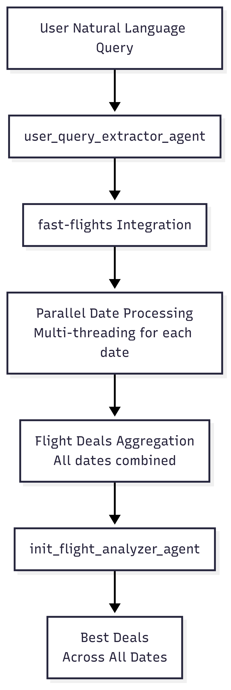

# FlyGPT - AI Agent for Smart Flight Search

> **Inspired by [Zomunk](https://zomunk.com/)** and the problems I faced while searching for the best flight deals, FlyGPT is an AI Agent that searches on multiple dates or a month and returns the list of flights which has the best duration and price.

## 🎯 The Problem

Finding the best flight deals is a nightmare:
- **Manual Date Checking**: Searching day by day across a month
- **Time Consuming**: Hours spent comparing prices and durations
- **Missed Deals**: Best prices often hidden on specific dates
- **Complex Queries**: Natural language requests need manual interpretation

## 🚀 The Solution

FlyGPT is a **FASTAPI wrapper on top of [`fast-flights`](https://github.com/AWeirdDev/flights)** with intelligent AI agents built using the **Agno Framework**. It automatically:

- **Expands Date Ranges**: "June 2025" → searches all 30 days
- **Natural Language Processing**: Understands conversational queries
- **Parallel Search**: Searches multiple dates simultaneously
- **Smart Ranking**: Returns top deals based on price, duration, and stops

## 🤖 Agent Architecture

The system uses **two specialized AI agents**:

### **Agent 1: Query Transformer**
- **Purpose**: Converts natural language to structured search parameters
- **Input**: "Find me best flights from Bangalore to Ahmedabad in June"
- **Output**: Structured query with airports, dates, passengers, preferences
- **Technology**: Claude 3.5 Sonnet via Agno Framework

### **Agent 2: Flight Analyzer**
- **Purpose**: Analyzes Google Flights responses and ranks best deals
- **Input**: Raw flight data from [`fast-flights`](https://github.com/AWeirdDev/flights) across multiple dates
- **Output**: Top 10 ranked flights with price, duration, and stop analysis
- **Technology**: Claude 3.5 Sonnet via Agno Framework

## 🔄 Agent Flow Chart



*The complete flow from natural language query to ranked flight results*

## 🏗️ Technical Stack

- **Backend**: FastAPI + Python
- **AI Framework**: Agno Framework
- **LLM**: Claude 3.5 Sonnet (Anthropic)
- **Flight Data**: [`fast-flights`](https://github.com/AWeirdDev/flights) (Google Flights wrapper)
- **Data Models**: Pydantic for validation
- **API**: RESTful endpoints with search ID tracking

## 🚀 Quick Start

### 1. **Install Dependencies**
```bash
pip install -r requirements.txt
```

### 2. **Set Environment Variables**
```bash
# Create .env file
ANTHROPIC_API_KEY=your_claude_api_key_here
FLIGHTS_API_HOST=0.0.0.0
FLIGHTS_API_PORT=3001
```

### 3. **Run the API**
```bash
python3 api/app.py
```


## 🔧 API Usage

### **Search Flights Endpoint**
```bash
POST /api/v1/searchFlights/{search_id}
```

**Request Body:**
```json
{
  "user_query": "Find me best flights from Bangalore to Ahmedabad in June 2025"
}
```

**Response:**
```json
{
  "search_id": "search_123456",
  "summary": "Best flight options for 1 adult from Bangalore to Ahmedabad in June 2025",
  "flights": [
    {
      "airline": "IndiGo",
      "departure": "2025-06-15T08:30:00",
      "arrival": "2025-06-15T10:45:00",
      "price": "₹3,500",
      "duration": "2h 15m",
      "stops": 0
    }
  ]
}
```

## 🌟 Key Features

- **🎯 Multi-Date Search**: Automatically expands "June" to all June dates
- **🚀 Parallel Processing**: Searches 30 dates simultaneously vs. sequentially
- **🤖 AI-Powered**: Natural language understanding and intelligent ranking
- **📊 Smart Analysis**: Multi-criteria optimization (price, duration, stops)
- **🔍 Search Tracking**: Unique search ID for debugging and support
- **🌐 Google Flights**: Leverages Google's comprehensive flight data via [`fast-flights`](https://github.com/AWeirdDev/flights)

## 🏆 Why This Architecture?

- **Separation of Concerns**: Each agent has a focused responsibility
- **Scalability**: Easy to add new agents or modify existing ones
- **Maintainability**: Clear data contracts between agents
- **Reliability**: Robust error handling and validation
- **User Experience**: Natural language to structured results

## 📁 Project Structure

```
final_fly_gpt/
├── api/
│   └── app.py              # FastAPI application
├── src/
│   ├── agno_agent.py       # AI agent definitions
│   ├── core.py             # Flight search engine
│   ├── main.py             # Main orchestration
│   ├── json_schema.py      # Data models
│   └── logger.py           # Logging utilities
├── tests/                  # Test files
├── requirements.txt        # Python dependencies
└── README.md              # This file
```

## 🤝 Contributing

This project is open source and welcomes contributions! Please read our [Contributing Guidelines](CONTRIBUTING.md) for details.

## 📄 License

This project is licensed under the MIT License - see the [LICENSE](LICENSE) file for details.

---

**All hail [Google Flights](https://flights.google.com/) and [`fast-flights`](https://github.com/AWeirdDev/flights)! 🛫**

*Built with ❤️ using Agno Framework and Claude 3.5 Sonnet*

*Inspired by the amazing flight deals from [Zomunk](https://zomunk.com/)*
